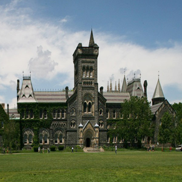
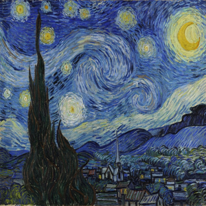
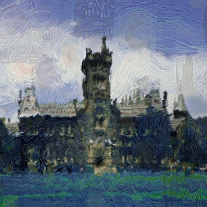
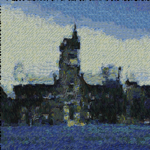
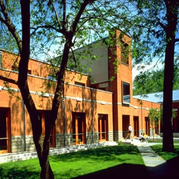
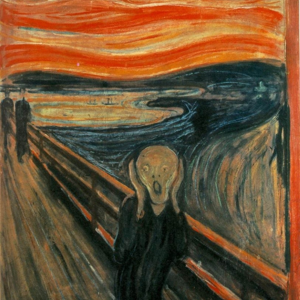
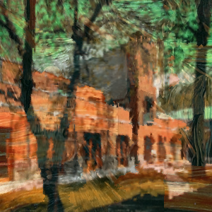
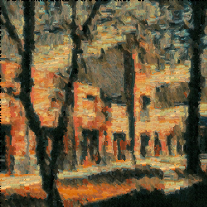

# Image Style Transfer without ML

Hang Chu, University of Toronto, CSC2523 Course Project

## Report:

**A Curious Exploration of Image Style Transfer — Using Color-Shape-Texture Cues, without ML**  
Hang Chu 
[pdf](https://github.com/chuhang/StyleTransfer-noML/blob/master/report.pdf)

## Results:
Example1:






Example2:







## Requirements:
- Matlab (developed & tested on R2016b)
- Computer Vision Toolbox

## Usage:
### 1. Run the demo

```
run_demo.m
```

We saved AMAT result in data.mat and data2.mat. This demo does not use Image Quilting.

### 2. Get all dependencies

- Get AMAT from [AMAT](https://github.com/tsogkas/amat)
- Get Image Quilting from [ImageQuilting](https://github.com/PJunhyuk/ImageQuilting)
